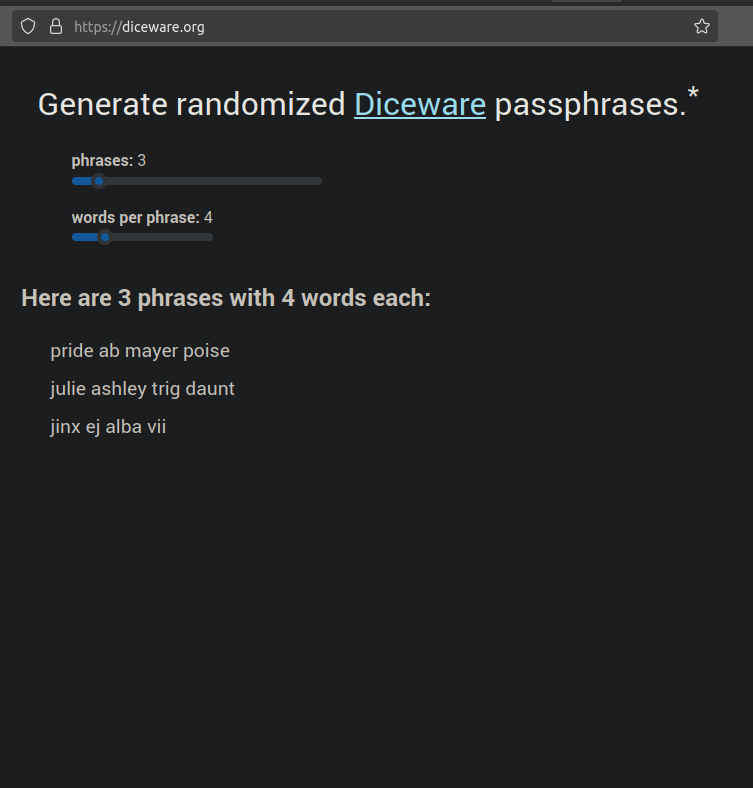

# diceware.org
A simple web app that generates Diceware-inspired passphrases. See it in action at [diceware.org](https://diceware.org).



For a command line utility that does the same thing, see [dicegen](https://github.com/rotarydialer/dicegen).

## Developing locally

From the project directory, run:

### `npm start`

Runs the app in the development mode.\
Open [http://localhost:3000](http://localhost:3000) to view it in your browser.

The page will reload when you make changes.\
You may also see any lint errors in the console.

### `npm test`

Launches the test runner in the interactive watch mode.

```
$ npm test

 PASS  src/diceware.test.js
 PASS  src/components/Phrases.test.js

Test Suites: 2 passed, 2 total
Tests:       9 passed, 9 total
Snapshots:   0 total
Time:        0.98 s, estimated 1 s
Ran all test suites.

Watch Usage: Press w to show more.
```

### `npm run build`

Builds the app for production to the `build` folder.\
It correctly bundles React in production mode and optimizes the build for the best performance.

The build is minified and the filenames include the hashes.\
Your app is ready to be deployed!
